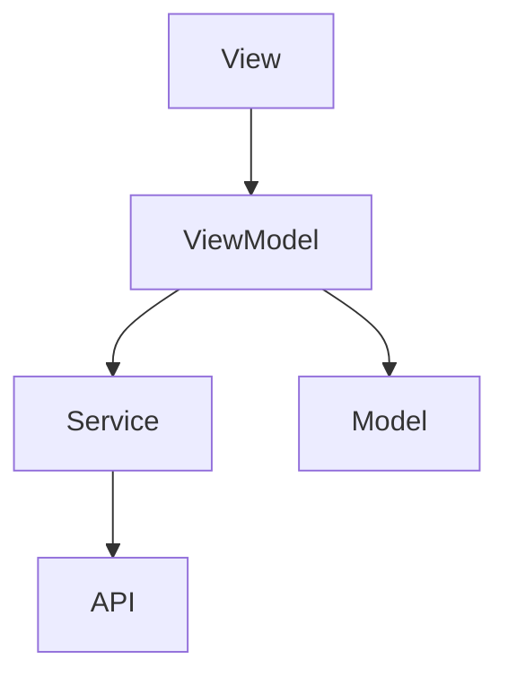
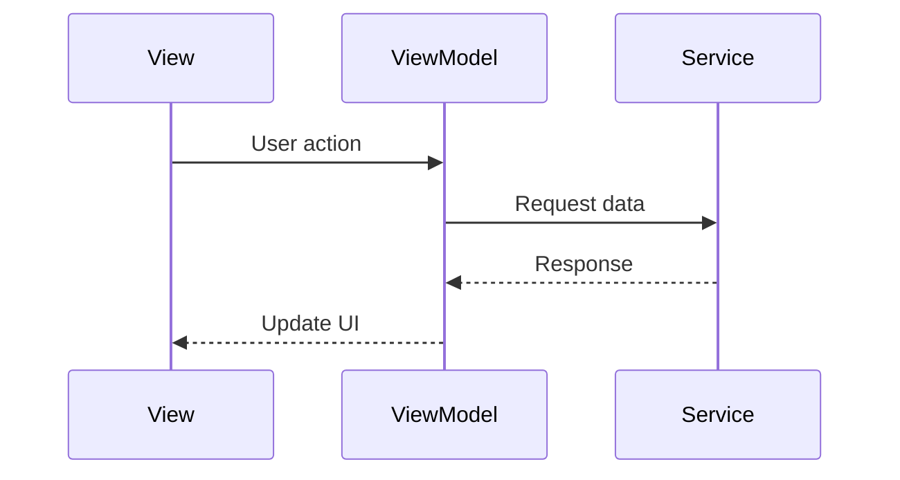

Create architecture and system design documentation.

## Prerequisites
Check that `.specs/requirements.md` exists. If not, guide user through the workflow.

## Workflow

1. Read `.specs/prd.md` and `.specs/requirements.md`
2. Analyze the existing codebase:
   - Project structure and patterns
   - Existing models, views, services
   - Tech stack and conventions
   - Style guide (`docs/style.md` if exists)
3. Design the architecture to fulfill requirements
4. Generate `.specs/design.md`

## Output Format for `.specs/design.md`

```markdown
# [Feature Name] - Design

## Overview
Brief description of the architectural approach.

## Tech Stack
- SwiftUI / UIKit
- Dependencies being added
- APIs being used

## Architecture Diagram



## Component Design

### New Files

#### [FileName].swift
- **Type**: View | ViewModel | Model | Service
- **Purpose**: What this component does
- **Dependencies**: What it depends on
- **Key Methods**:
  - `methodName()`: Description

### Modified Files

#### [ExistingFile].swift
- **Changes**: What modifications are needed
- **Reason**: Why this file needs changes

## Data Flow



## Data Models

### [ModelName]
```swift
struct ModelName: Codable, Identifiable {
    let id: UUID
    let property: String
}
```

## State Management
- How state flows through the feature
- What @State, @Binding, @ObservedObject are used

## Error Handling
- How errors are caught and displayed
- Recovery strategies

## Security Considerations
- Data protection
- Authentication requirements

## Performance Considerations
- Lazy loading strategies
- Caching approach
- Image optimization

## Accessibility
- VoiceOver support
- Dynamic Type support

## Testing Strategy
- What to unit test
- What to UI test
```

## Instructions

1. Follow existing codebase patterns and conventions
2. Use MVVM architecture for SwiftUI
3. Include Mermaid diagrams for visual clarity
4. Consider the full data flow from UI to backend
5. Address all requirements from `.specs/requirements.md`

After generating design, display it and ask the user to review before proceeding to `/kiro:spec-tasks`.

**IMPORTANT**: Wait for explicit user approval before proceeding to the tasks phase.
