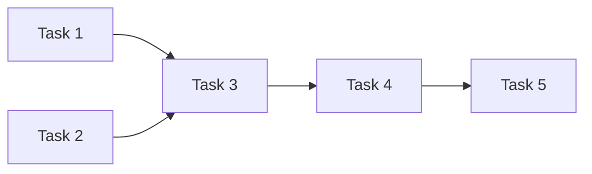

Break down the design into implementation tasks with dependencies.

## Prerequisites
Check that `.specs/design.md` exists. If not, guide user through the workflow.

## Workflow

1. Read all spec files: `prd.md`, `requirements.md`, `design.md`
2. Break down the implementation into discrete, ordered tasks
3. Map dependencies between tasks
4. Generate `.specs/tasks.md`

## Output Format for `.specs/tasks.md`

```markdown
# [Feature Name] - Implementation Tasks

## Summary
- Total tasks: N
- Estimated complexity: Low | Medium | High

## Task Dependency Graph



## Tasks

### Task 1: [Task Title]
- **Status**: Pending | In Progress | Completed
- **Dependencies**: None | Task N
- **Files**:
  - Create: `path/to/NewFile.swift`
  - Modify: `path/to/ExistingFile.swift`
- **Requirements Addressed**: FR-1, FR-2
- **Description**:
  Detailed description of what this task accomplishes.
- **Implementation Notes**:
  - Specific implementation details
  - Code patterns to use
  - Edge cases to handle
- **Acceptance Criteria**:
  - [ ] Criterion 1
  - [ ] Criterion 2

### Task 2: [Task Title]
...

## Implementation Order
1. Task 1 - [Brief description]
2. Task 2 - [Brief description]
3. ...

## Testing Tasks

### Test Task 1: Unit Tests for [Component]
- **Dependencies**: Task N (the implementation task)
- **Test Cases**:
  - Test case 1
  - Test case 2

## Integration Checklist
- [ ] All tasks completed
- [ ] Unit tests passing
- [ ] UI tests passing
- [ ] Code reviewed
- [ ] Documentation updated
```

## Instructions

1. Make tasks atomic - each task should be completable in one session
2. Order tasks by dependencies (foundational work first)
3. Include both implementation and testing tasks
4. Map each task to the requirements it fulfills
5. Be specific about files to create/modify
6. Include clear acceptance criteria

After generating tasks, display them and ask the user to review before proceeding to `/kiro:spec-impl`.

**IMPORTANT**: Wait for explicit user approval before proceeding to implementation.
