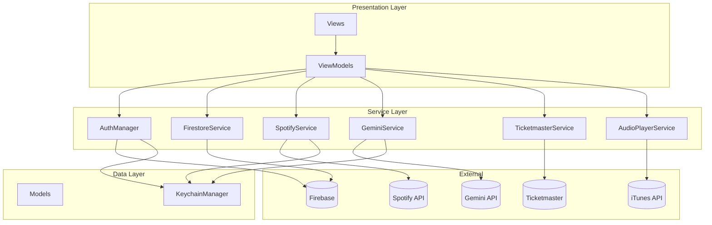
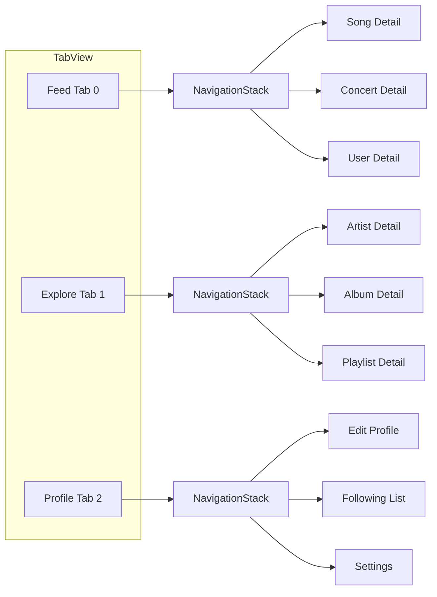
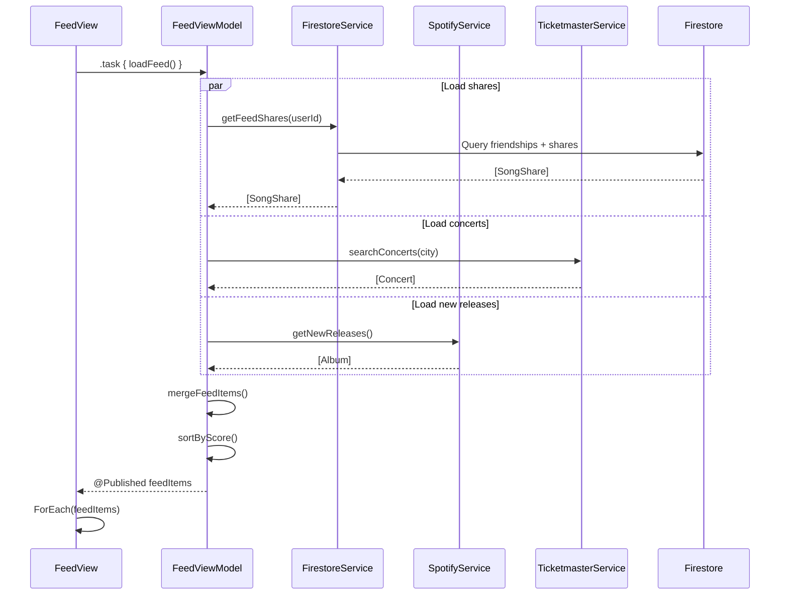
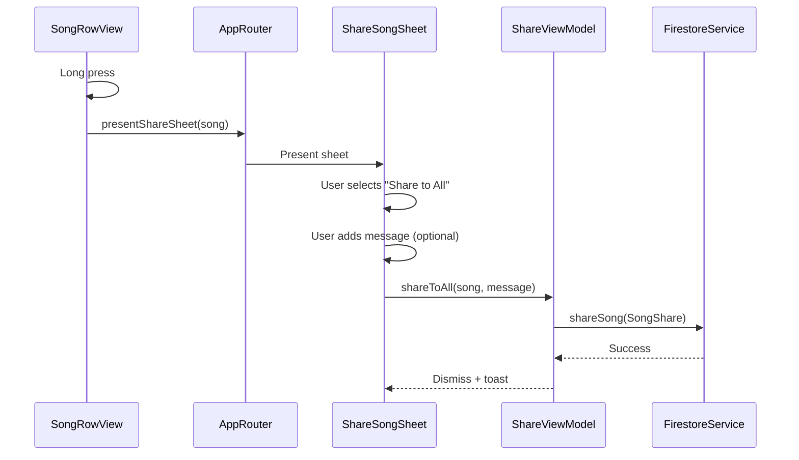
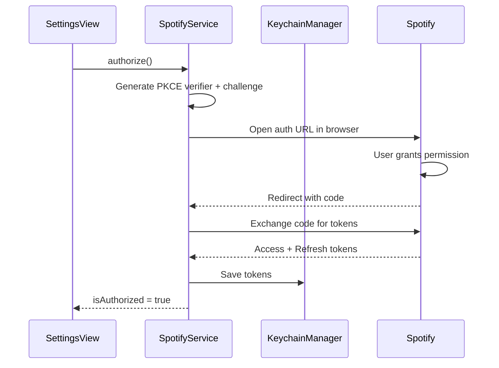

# Vibes - System Design

## Overview

Vibes is built using **MVVM architecture** with SwiftUI, following a clean separation of concerns. The app uses a **3-tab navigation model** (Feed, Explore, Profile) with a centralized router for navigation state management.

---

## Tech Stack

### Core
- **Language**: Swift 5.9+
- **UI Framework**: SwiftUI
- **Architecture**: MVVM with Coordinator/Router pattern
- **Minimum iOS**: 17.0

### Dependencies
| Package | Purpose |
|---------|---------|
| Firebase SDK | Auth, Firestore, Storage, Cloud Messaging |
| GoogleSignIn | Google OAuth |
| SpotifyAPI (Peter-Schorn) | Spotify OAuth with PKCE |
| ShazamKit | Song identification |

### External APIs
| API | Purpose | Auth |
|-----|---------|------|
| Firebase Auth | User authentication | Google OAuth |
| Firestore | Real-time database | Firebase SDK |
| Spotify Web API | Music search, playlists, user data | OAuth + PKCE |
| Google Gemini | AI playlist generation | User API key |
| Ticketmaster | Concert discovery | API key |
| iTunes Search | Song previews (30s) | None |

---

## High-Level Architecture



---

## Project Structure

```
vibes/
├── vibesApp.swift              # App entry, Firebase config
├── ContentView.swift           # Root view with TabView
│
├── Models/
│   ├── UserProfile.swift       # User data model
│   ├── Friendship.swift        # Follow relationship
│   ├── SongShare.swift         # Shared song in feed
│   ├── Message.swift           # DM message
│   ├── MessageThread.swift     # Conversation thread
│   ├── FeedItem.swift          # Unified feed item enum
│   ├── Concert.swift           # Ticketmaster concert
│   ├── Achievement.swift       # Gamification badge
│   ├── ListeningStats.swift    # User stats from Spotify
│   └── UnifiedTrack.swift      # Spotify track wrapper
│
├── ViewModels/
│   ├── AuthViewModel.swift     # Auth form state
│   ├── FeedViewModel.swift     # Feed data & actions
│   ├── ExploreViewModel.swift  # Search & discovery
│   ├── ProfileViewModel.swift  # User profile management
│   ├── SongDetailViewModel.swift
│   ├── ArtistDetailViewModel.swift
│   ├── PlaylistViewModel.swift
│   └── SettingsViewModel.swift
│
├── Views/
│   ├── Auth/
│   │   ├── AuthView.swift      # Google sign-in
│   │   └── TutorialView.swift  # Onboarding cards
│   │
│   ├── Feed/
│   │   ├── FeedView.swift      # Main feed tab
│   │   ├── FeedCardView.swift  # Generic feed card
│   │   ├── SongShareCard.swift
│   │   ├── ConcertCard.swift
│   │   └── QuickActionsBar.swift
│   │
│   ├── Explore/
│   │   ├── ExploreView.swift   # Search & discover tab
│   │   ├── SearchResultsView.swift
│   │   ├── ForYouSection.swift
│   │   └── GrowPlaylistView.swift
│   │
│   ├── Profile/
│   │   ├── ProfileView.swift   # User profile tab
│   │   ├── EditProfileView.swift
│   │   ├── FollowingListView.swift
│   │   ├── FindUsersView.swift
│   │   └── StatsView.swift
│   │
│   ├── Detail/
│   │   ├── SongDetailView.swift
│   │   ├── ArtistDetailView.swift
│   │   ├── AlbumDetailView.swift
│   │   ├── PlaylistDetailView.swift
│   │   ├── ConcertDetailView.swift
│   │   └── UserProfileDetailView.swift
│   │
│   ├── Settings/
│   │   ├── SettingsView.swift
│   │   ├── SpotifySettingsView.swift
│   │   ├── GeminiKeyView.swift
│   │   └── ConcertCityView.swift
│   │
│   ├── Sheets/
│   │   ├── ShareSongSheet.swift
│   │   ├── UserPickerSheet.swift
│   │   ├── PlaylistPickerSheet.swift
│   │   └── AIPlaylistSheet.swift
│   │
│   └── Components/
│       ├── SongRowView.swift   # Reusable song row
│       ├── UserRowView.swift
│       ├── LoadingView.swift
│       ├── EmptyStateView.swift
│       └── ErrorView.swift
│
├── Services/
│   ├── AuthManager.swift       # Firebase Auth + state
│   ├── FirestoreService.swift  # Firestore CRUD
│   ├── SpotifyService.swift    # Spotify OAuth + API
│   ├── GeminiService.swift     # AI playlist generation
│   ├── TicketmasterService.swift
│   ├── AudioPlayerService.swift
│   ├── KeychainManager.swift   # Secure storage
│   ├── NotificationService.swift
│   └── AppRouter.swift         # Navigation coordinator
│
└── Utilities/
    ├── Extensions/
    │   ├── Date+Extensions.swift
    │   └── View+Extensions.swift
    └── Constants.swift
```

---

## Navigation Architecture

### Tab Structure



### AppRouter

```swift
@Observable
class AppRouter {
    enum Tab: Int { case feed, explore, profile }

    var selectedTab: Tab = .feed
    var feedPath = NavigationPath()
    var explorePath = NavigationPath()
    var profilePath = NavigationPath()

    // Sheet presentation
    var presentedSheet: Sheet?

    enum Sheet: Identifiable {
        case shareSong(UnifiedTrack)
        case userPicker(UnifiedTrack)
        case playlistPicker(UnifiedTrack)
        case aiPlaylist

        var id: String { ... }
    }

    // Navigation methods
    func navigateToSongDetail(_ song: UnifiedTrack) { ... }
    func navigateToUserProfile(_ user: UserProfile) { ... }
    func presentShareSheet(for song: UnifiedTrack) { ... }
}
```

---

## Data Models

### UserProfile

```swift
struct UserProfile: Codable, Identifiable {
    @DocumentID var id: String?
    var uid: String
    var email: String
    var username: String
    var displayName: String
    var bio: String?
    var profilePictureURL: String?
    var spotifyId: String?
    var spotifyLinked: Bool
    var geminiKeyConfigured: Bool
    var concertCity: String?
    var createdAt: Date
    var updatedAt: Date
    var fcmToken: String?

    struct PrivacySettings: Codable {
        var profileVisibility: String = "public"
        var showListeningStats: Bool = true
    }
    var privacySettings: PrivacySettings
}
```

### Friendship

```swift
struct Friendship: Codable, Identifiable {
    @DocumentID var id: String?
    var followerId: String      // Who is following
    var followingId: String     // Who is being followed
    var createdAt: Date
    var vibestreak: Int = 0
    var lastInteractionDate: Date?
}
```

### SongShare

```swift
struct SongShare: Codable, Identifiable {
    @DocumentID var id: String?
    var senderId: String
    var senderUsername: String
    var senderProfilePicture: String?
    var recipientId: String?    // nil = shared to all
    var spotifyTrackId: String
    var trackName: String
    var artistName: String
    var albumArtURL: String
    var previewURL: String?
    var message: String?
    var timestamp: Date
}
```

### FeedItem

```swift
enum FeedItem: Identifiable {
    case songShare(SongShare)
    case concert(Concert)
    case newFollow(Friendship, UserProfile)
    case newRelease(UnifiedAlbum)
    case aiRecommendation(UnifiedTrack, String) // track + reason

    var id: String { ... }
    var timestamp: Date { ... }
    var sortScore: Double { ... }
}
```

### Concert

```swift
struct Concert: Codable, Identifiable {
    var id: String
    var artistName: String
    var artistImageURL: String?
    var venueName: String
    var venueAddress: String
    var city: String
    var date: Date
    var priceRange: String?
    var ticketURL: String
    var additionalArtists: [String]
}
```

### Achievement

```swift
struct Achievement: Codable, Identifiable {
    @DocumentID var id: String?
    var userId: String
    var type: AchievementType
    var unlockedAt: Date
    var progress: Int

    enum AchievementType: String, Codable {
        case firstShare
        case tenFollows
        case genreExplorer
        case streakBronze
        case streakSilver
        case streakGold
    }
}
```

---

## Service Layer

### AuthManager

```swift
@MainActor
class AuthManager: ObservableObject {
    static let shared = AuthManager()

    @Published var user: FirebaseAuth.User?
    @Published var userProfile: UserProfile?
    @Published var isAuthenticated = false
    @Published var isSpotifyLinked = false
    @Published var isGeminiConfigured = false

    private var authStateListener: AuthStateDidChangeListenerHandle?

    // Auth methods
    func signInWithGoogle() async throws
    func signOut() throws
    func deleteAccount() async throws

    // Profile methods
    func loadUserProfile() async throws
    func updateProfile(_ profile: UserProfile) async throws
}
```

### FirestoreService

```swift
@MainActor
class FirestoreService {
    static let shared = FirestoreService()
    private let db = Firestore.firestore()

    // Users
    func getUser(id: String) async throws -> UserProfile
    func updateUser(_ user: UserProfile) async throws
    func searchUsers(query: String) async throws -> [UserProfile]

    // Friendships (Follow)
    func follow(userId: String, targetId: String) async throws
    func unfollow(userId: String, targetId: String) async throws
    func getFollowing(userId: String) async throws -> [UserProfile]
    func getFollowers(userId: String) async throws -> [UserProfile]

    // Song Shares
    func shareSong(_ share: SongShare) async throws
    func getFeedShares(userId: String) async throws -> [SongShare]
    func listenToFeed(userId: String, handler: @escaping ([SongShare]) -> Void) -> ListenerRegistration

    // Messages
    func sendMessage(_ message: Message) async throws
    func getThread(user1: String, user2: String) async throws -> MessageThread?
    func listenToMessages(threadId: String, handler: @escaping ([Message]) -> Void) -> ListenerRegistration

    // Achievements
    func unlockAchievement(userId: String, type: Achievement.AchievementType) async throws
    func getAchievements(userId: String) async throws -> [Achievement]
}
```

### SpotifyService

```swift
@MainActor
class SpotifyService: ObservableObject {
    static let shared = SpotifyService()

    @Published var isAuthorized = false

    private let api: SpotifyAPI<AuthorizationCodeFlowPKCEManager>
    private let keychain = KeychainManager.shared

    // Auth
    func authorize() -> URL
    func handleCallback(url: URL) async throws
    func refreshTokensIfNeeded() async throws
    func deauthorize()

    // Search
    func search(query: String, types: [IDCategory]) async throws -> SearchResult

    // User Data
    func getCurrentUser() async throws -> SpotifyUser
    func getTopArtists(timeRange: TimeRange) async throws -> [Artist]
    func getTopTracks(timeRange: TimeRange) async throws -> [Track]
    func getUserPlaylists() async throws -> [Playlist]

    // Library
    func saveTrack(id: String) async throws
    func removeTrack(id: String) async throws
    func addToPlaylist(playlistId: String, trackUri: String) async throws

    // Recommendations
    func getRecommendations(seedTracks: [String]) async throws -> [Track]

    // Playlist Creation
    func createPlaylist(name: String, tracks: [String]) async throws -> Playlist
}
```

### GeminiService

```swift
@MainActor
class GeminiService: ObservableObject {
    static let shared = GeminiService()

    @Published var isConfigured = false

    private var apiKey: String?
    private let keychain = KeychainManager.shared

    // Configuration
    func configure(apiKey: String) async throws
    func validateKey(_ key: String) async throws -> Bool
    func clearKey()

    // AI Features
    func generatePlaylist(prompt: String, userTaste: [String]) async throws -> [String] // track IDs
    func generateBlend(user1Taste: [String], user2Taste: [String]) async throws -> [String]
    func getSongRecommendations(basedOn tracks: [String]) async throws -> [(trackId: String, reason: String)]
    func getPlaylistGrowthSuggestions(playlistTracks: [String]) async throws -> [String]
}
```

### TicketmasterService

```swift
class TicketmasterService {
    static let shared = TicketmasterService()

    private let apiKey: String

    func searchConcerts(city: String, radius: Int = 50) async throws -> [Concert]
    func getConcertsForArtist(artistName: String, city: String?) async throws -> [Concert]
}
```

### AudioPlayerService

```swift
@MainActor
class AudioPlayerService: ObservableObject {
    static let shared = AudioPlayerService()

    @Published var currentTrack: UnifiedTrack?
    @Published var isPlaying = false
    @Published var progress: Double = 0

    private var player: AVPlayer?

    func play(track: UnifiedTrack) async
    func pause()
    func stop()
    func seek(to progress: Double)

    // iTunes preview URL lookup
    func fetchPreviewURL(for track: UnifiedTrack) async throws -> URL?
}
```

### KeychainManager

```swift
class KeychainManager {
    static let shared = KeychainManager()

    enum Key: String {
        case spotifyAccessToken
        case spotifyRefreshToken
        case geminiApiKey
    }

    func save(_ value: String, for key: Key) throws
    func retrieve(key: Key) -> String?
    func delete(key: Key) throws
    func clearAll() throws
}
```

---

## Data Flow

### Feed Loading



### Share Song Flow



### Spotify OAuth Flow



---

## State Management

### App-Level State

```swift
@main
struct vibesApp: App {
    @StateObject private var authManager = AuthManager.shared
    @State private var router = AppRouter()

    init() {
        FirebaseApp.configure()
    }

    var body: some Scene {
        WindowGroup {
            ContentView()
                .environmentObject(authManager)
                .environment(router)
        }
    }
}
```

### View State Pattern

```swift
struct FeedView: View {
    @Environment(AppRouter.self) private var router
    @EnvironmentObject var authManager: AuthManager
    @StateObject private var viewModel = FeedViewModel()

    // Local UI state
    @State private var showShareSheet = false
    @State private var selectedSong: UnifiedTrack?

    var body: some View {
        NavigationStack(path: $router.feedPath) {
            feedContent
                .navigationDestination(for: SongShare.self) { share in
                    SongDetailView(share: share)
                }
        }
        .task {
            await viewModel.loadFeed(userId: authManager.userProfile?.uid)
        }
    }
}
```

### ViewModel State Pattern

```swift
@MainActor
class FeedViewModel: ObservableObject {
    @Published var feedItems: [FeedItem] = []
    @Published var isLoading = false
    @Published var error: Error?

    private let firestoreService = FirestoreService.shared
    private let spotifyService = SpotifyService.shared
    private let ticketmasterService = TicketmasterService.shared

    private var feedListener: ListenerRegistration?

    func loadFeed(userId: String?) async {
        guard let userId else { return }
        isLoading = true
        defer { isLoading = false }

        do {
            async let shares = firestoreService.getFeedShares(userId: userId)
            async let concerts = loadConcerts()
            async let releases = loadNewReleases()

            let allItems = try await mergeItems(
                shares: shares,
                concerts: concerts,
                releases: releases
            )

            feedItems = sortByScore(allItems)
        } catch {
            self.error = error
        }
    }

    func startRealtimeUpdates(userId: String) {
        feedListener = firestoreService.listenToFeed(userId: userId) { [weak self] shares in
            // Update feedItems with new shares
        }
    }

    deinit {
        feedListener?.remove()
    }
}
```

---

## Error Handling

### Error Types

```swift
enum VibesError: LocalizedError {
    case notAuthenticated
    case spotifyNotConnected
    case geminiNotConfigured
    case networkError(Error)
    case firestoreError(Error)
    case spotifyError(Error)
    case invalidData

    var errorDescription: String? {
        switch self {
        case .notAuthenticated:
            return "Please sign in to continue"
        case .spotifyNotConnected:
            return "Connect Spotify to use this feature"
        case .geminiNotConfigured:
            return "Add your Gemini API key in Settings"
        case .networkError:
            return "Network connection failed. Please try again."
        case .firestoreError(let error):
            return error.localizedDescription
        case .spotifyError(let error):
            return error.localizedDescription
        case .invalidData:
            return "Something went wrong. Please try again."
        }
    }
}
```

### Error Handling Pattern

```swift
struct FeedView: View {
    @StateObject private var viewModel = FeedViewModel()

    var body: some View {
        Group {
            if viewModel.isLoading {
                LoadingView()
            } else if let error = viewModel.error {
                ErrorView(error: error) {
                    Task { await viewModel.loadFeed(userId: userId) }
                }
            } else if viewModel.feedItems.isEmpty {
                EmptyStateView(
                    title: "No activity yet",
                    message: "Follow users and share songs!",
                    action: { router.selectedTab = .explore }
                )
            } else {
                feedList
            }
        }
    }
}
```

---

## Security Considerations

### Token Storage
- All OAuth tokens stored in iOS Keychain (never UserDefaults)
- Spotify uses PKCE (no client secret in app)
- Gemini API key stored in Keychain
- Tokens cleared on sign out

### Firebase Security Rules

```javascript
rules_version = '2';
service cloud.firestore {
  match /databases/{database}/documents {
    // Users can only read/write their own profile
    match /users/{userId} {
      allow read: if request.auth != null;
      allow write: if request.auth.uid == userId;
    }

    // Friendships - only participants can access
    match /friendships/{docId} {
      allow read: if request.auth.uid == resource.data.followerId
                  || request.auth.uid == resource.data.followingId;
      allow create: if request.auth.uid == request.resource.data.followerId;
      allow delete: if request.auth.uid == resource.data.followerId;
    }

    // Song shares - visible to followers
    match /songShares/{shareId} {
      allow read: if request.auth != null;
      allow create: if request.auth.uid == request.resource.data.senderId;
      allow delete: if request.auth.uid == resource.data.senderId;
    }
  }
}
```

---

## Performance Considerations

### Lazy Loading
- Feed uses `LazyVStack` for efficient scrolling
- Images use `AsyncImage` with placeholder
- Pagination for feed (load 20 items, fetch more on scroll)

### Caching
- Spotify search results cached in memory (5 min TTL)
- User profiles cached locally
- Album art cached via URLCache

### Image Optimization
- Album art: 300x300 for cards, 600x600 for detail
- Profile photos: 200x200 max
- Use WebP format where supported

### Real-time Updates
- Firestore listeners for feed updates
- Detach listeners in `onDisappear`
- Batch writes for multiple operations

---

## Accessibility

### VoiceOver Support
- All buttons have accessibility labels
- Images have accessibility descriptions
- Custom controls are accessible
- Logical navigation order

### Dynamic Type
- All text uses semantic styles (.headline, .body, etc.)
- No fixed font sizes
- Layout adapts to larger text

### Implementation

```swift
SongRowView(track: track)
    .accessibilityElement(children: .combine)
    .accessibilityLabel("\(track.name) by \(track.artist)")
    .accessibilityHint("Double tap to play preview. Long press for more options.")
    .accessibilityAddTraits(.isButton)
```

---

## Testing Strategy

### Unit Tests
- ViewModels: Test state changes, async methods
- Services: Mock network responses
- Models: Codable encoding/decoding

### UI Tests
- Auth flow: Sign in, sign out
- Core flows: Search, share song, follow user
- Navigation: Tab switching, back navigation

### Test Targets

```
vibesTests/
├── ViewModelTests/
│   ├── FeedViewModelTests.swift
│   ├── ExploreViewModelTests.swift
│   └── ProfileViewModelTests.swift
├── ServiceTests/
│   ├── FirestoreServiceTests.swift
│   ├── SpotifyServiceTests.swift
│   └── GeminiServiceTests.swift
└── ModelTests/
    └── CodableTests.swift

vibesUITests/
├── AuthFlowTests.swift
├── FeedFlowTests.swift
└── ShareFlowTests.swift
```

---

## Component Specifications

### SongRowView (Reusable)

```swift
struct SongRowView: View {
    let track: UnifiedTrack
    let showSender: Bool
    let senderName: String?

    @EnvironmentObject var audioPlayer: AudioPlayerService
    @Environment(AppRouter.self) var router

    var body: some View {
        HStack(spacing: 12) {
            // Album art with play overlay
            albumArtView

            // Track info
            VStack(alignment: .leading, spacing: 2) {
                Text(track.name)
                    .font(.subheadline)
                    .fontWeight(.medium)
                    .lineLimit(1)

                Text(track.artistName)
                    .font(.caption)
                    .foregroundStyle(.secondary)
                    .lineLimit(1)

                if showSender, let sender = senderName {
                    Text("From \(sender)")
                        .font(.caption2)
                        .foregroundStyle(.tertiary)
                }
            }

            Spacer()
        }
        .contentShape(Rectangle())
        .onTapGesture { togglePlayback() }
        .contextMenu { contextMenuItems }
    }

    @ViewBuilder
    private var contextMenuItems: some View {
        Button { router.presentedSheet = .userPicker(track) } label: {
            Label("Send to Friend", systemImage: "paperplane")
        }
        Button { router.presentedSheet = .playlistPicker(track) } label: {
            Label("Add to Playlist", systemImage: "plus.circle")
        }
        Button { openInSpotify() } label: {
            Label("Open in Spotify", systemImage: "arrow.up.right")
        }
    }
}
```

---

## Migration Notes

This design assumes a fresh implementation. Key decisions:

1. **Google-only auth** - No email/password complexity
2. **Asymmetric follow** - Not mutual friend requests
3. **User-provided Gemini key** - No backend AI costs
4. **3-tab navigation** - Simplified from earlier 4-tab design
5. **Unified feed** - All content types in single stream
