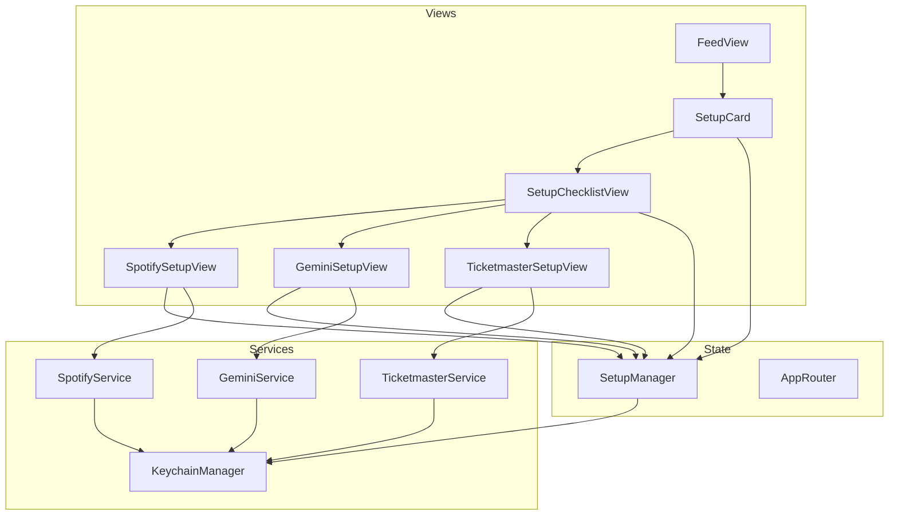
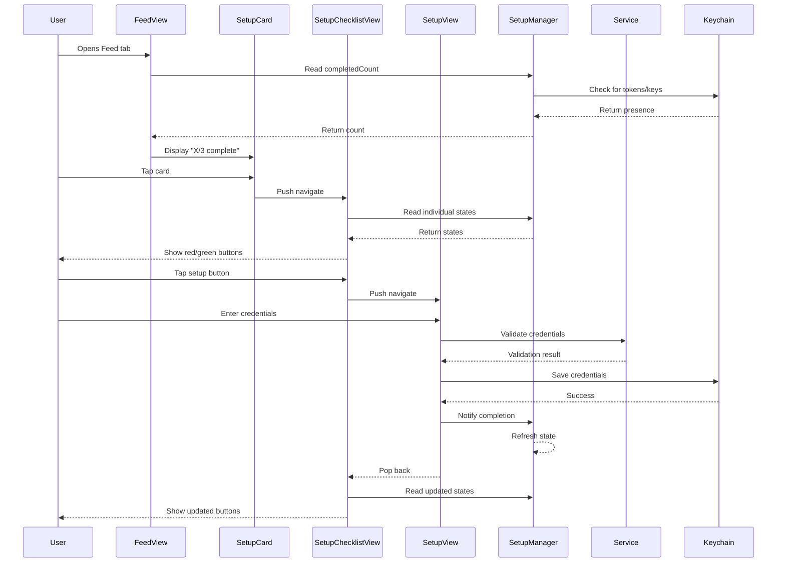

# Setup Feature - Design

## Overview

The Setup feature uses a centralized `SetupManager` to track completion state of three required services. A `SetupCard` component in FeedView provides entry to the setup flow, which uses push navigation through a checklist to individual setup views.

## Tech Stack

- **UI Framework**: SwiftUI
- **Architecture**: MVVM with @Observable
- **Navigation**: NavigationStack with NavigationPath
- **Storage**: iOS Keychain (credentials), UserDefaults (city, completion status)
- **External APIs**: Spotify OAuth, Gemini API, Ticketmaster API

## Architecture Diagram



## Component Design

### New Files

#### vibes/Services/SetupManager.swift
- **Type**: Service (Observable)
- **Purpose**: Centralized state management for setup completion
- **Dependencies**: KeychainManager
- **Key Properties**:
  - `isSpotifyComplete: Bool` (computed from Keychain)
  - `isGeminiComplete: Bool` (computed from Keychain)
  - `isTicketmasterComplete: Bool` (computed from Keychain + UserDefaults)
  - `completedCount: Int` (0-3)
  - `isAllComplete: Bool`
- **Key Methods**:
  - `checkCompletionStatus()`: Refresh all completion states
  - `markSpotifyComplete()`: Called after OAuth success
  - `markGeminiComplete()`: Called after key validation
  - `markTicketmasterComplete()`: Called after key + city saved

```swift
@Observable
class SetupManager {
    private let keychain = KeychainManager.shared

    var isSpotifyComplete: Bool {
        keychain.getSpotifyAccessToken() != nil
    }

    var isGeminiComplete: Bool {
        keychain.getGeminiApiKey() != nil
    }

    var isTicketmasterComplete: Bool {
        keychain.getTicketmasterApiKey() != nil &&
        UserDefaults.standard.string(forKey: "concertCity") != nil
    }

    var completedCount: Int {
        [isSpotifyComplete, isGeminiComplete, isTicketmasterComplete]
            .filter { $0 }.count
    }

    var isAllComplete: Bool {
        completedCount == 3
    }
}
```

---

#### vibes/Views/Setup/SetupCard.swift
- **Type**: View
- **Purpose**: Tappable card shown at top of Feed, navigates to checklist
- **Dependencies**: SetupManager, AppRouter
- **Key Properties**:
  - Progress text (e.g., "1/3 complete")
  - Tappable to navigate

```swift
struct SetupCard: View {
    @Environment(SetupManager.self) private var setupManager

    var body: some View {
        Button(action: { /* navigate */ }) {
            HStack {
                VStack(alignment: .leading) {
                    Text("Setup")
                        .font(.headline)
                    Text("\(setupManager.completedCount)/3 complete")
                        .font(.subheadline)
                        .foregroundStyle(.secondary)
                }
                Spacer()
                Image(systemName: "chevron.right")
            }
            .padding()
            .background(Color(.secondarySystemBackground))
            .clipShape(RoundedRectangle(cornerRadius: 12))
        }
        .buttonStyle(.plain)
    }
}
```

---

#### vibes/Views/Setup/SetupChecklistView.swift
- **Type**: View
- **Purpose**: Display 3 setup buttons with red/green states
- **Dependencies**: SetupManager, AppRouter
- **Key Components**:
  - `SetupButton` subview with state-based color
  - Navigation to individual setup views

```swift
struct SetupChecklistView: View {
    @Environment(SetupManager.self) private var setupManager
    @Environment(AppRouter.self) private var router

    var body: some View {
        VStack(spacing: 16) {
            SetupButton(
                title: "Spotify",
                subtitle: "Connect your music library",
                isComplete: setupManager.isSpotifyComplete,
                destination: SetupDestination.spotify
            )

            SetupButton(
                title: "Gemini API Key",
                subtitle: "Enable AI features",
                isComplete: setupManager.isGeminiComplete,
                destination: SetupDestination.gemini
            )

            SetupButton(
                title: "Ticketmaster",
                subtitle: "Discover concerts near you",
                isComplete: setupManager.isTicketmasterComplete,
                destination: SetupDestination.ticketmaster
            )

            Spacer()
        }
        .padding()
        .navigationTitle("Setup")
    }
}
```

---

#### vibes/Views/Setup/SetupButton.swift
- **Type**: View
- **Purpose**: Reusable button with red/green state
- **Dependencies**: None (pure view)

```swift
struct SetupButton: View {
    let title: String
    let subtitle: String
    let isComplete: Bool
    let destination: SetupDestination

    var body: some View {
        NavigationLink(value: destination) {
            HStack {
                Image(systemName: isComplete ? "checkmark.circle.fill" : "exclamationmark.circle.fill")
                    .font(.title2)
                    .foregroundStyle(isComplete ? .green : .red)

                VStack(alignment: .leading) {
                    Text(title)
                        .font(.headline)
                    Text(subtitle)
                        .font(.subheadline)
                        .foregroundStyle(.secondary)
                }

                Spacer()

                Image(systemName: "chevron.right")
                    .foregroundStyle(.secondary)
            }
            .padding()
            .background(isComplete ? Color.green.opacity(0.1) : Color.red.opacity(0.1))
            .clipShape(RoundedRectangle(cornerRadius: 12))
        }
        .buttonStyle(.plain)
    }
}
```

---

#### vibes/Views/Setup/SpotifySetupView.swift
- **Type**: View
- **Purpose**: Instructions and OAuth trigger for Spotify
- **Dependencies**: SpotifyService, SetupManager
- **Key Components**:
  - Header and instructions
  - Connect button (triggers OAuth)
  - Connected state with disconnect option

---

#### vibes/Views/Setup/GeminiSetupView.swift
- **Type**: View
- **Purpose**: Instructions, link, and text field for Gemini API key
- **Dependencies**: GeminiService, SetupManager, KeychainManager
- **Key Components**:
  - Header and instructions
  - Link to Google AI Studio
  - SecureField for API key
  - Save button with validation

---

#### vibes/Views/Setup/TicketmasterSetupView.swift
- **Type**: View
- **Purpose**: Instructions, link, and fields for Ticketmaster API key + city
- **Dependencies**: TicketmasterService, SetupManager, KeychainManager
- **Key Components**:
  - Header and instructions
  - Link to Ticketmaster Developer Portal
  - SecureField for API key
  - TextField for city name
  - Save button with validation

---

### Modified Files

#### vibes/Services/KeychainManager.swift
- **Changes**: Add Ticketmaster API key storage
- **Reason**: FR-11 requires storing Ticketmaster API key securely

```swift
// Add to Key enum:
case ticketmasterApiKey

// Add methods:
func saveTicketmasterApiKey(_ key: String) throws {
    try save(key, for: .ticketmasterApiKey)
}

func getTicketmasterApiKey() -> String? {
    retrieve(key: .ticketmasterApiKey)
}
```

---

#### vibes/Services/AppRouter.swift
- **Changes**: Add SetupDestination enum and navigation support
- **Reason**: FR-2, FR-5 require push navigation to setup views

```swift
// Add enum:
enum SetupDestination: Hashable {
    case checklist
    case spotify
    case gemini
    case ticketmaster
}

// Add method:
func navigateToSetupChecklist() {
    feedPath.append(SetupDestination.checklist)
}
```

---

#### vibes/ContentView.swift (FeedView section)
- **Changes**:
  - Replace existing SetupCard with new version
  - Add navigationDestination for SetupDestination
- **Reason**: FR-1, FR-2 require SetupCard at top of Feed

```swift
// In FeedView body:
NavigationStack(path: $router.feedPath) {
    ScrollView {
        VStack(spacing: 16) {
            SetupCard()
                .padding(.horizontal)

            // ... rest of feed content
        }
    }
    .navigationDestination(for: SetupDestination.self) { destination in
        switch destination {
        case .checklist:
            SetupChecklistView()
        case .spotify:
            SpotifySetupView()
        case .gemini:
            GeminiSetupView()
        case .ticketmaster:
            TicketmasterSetupView()
        }
    }
}
```

---

#### vibes/vibesApp.swift
- **Changes**: Add SetupManager to environment
- **Reason**: SetupManager needs to be accessible throughout app

```swift
@main
struct vibesApp: App {
    @State private var setupManager = SetupManager()

    var body: some Scene {
        WindowGroup {
            ContentView()
                .environment(setupManager)
        }
    }
}
```

---

## Data Flow



## Data Models

### SetupDestination
```swift
enum SetupDestination: Hashable {
    case checklist
    case spotify
    case gemini
    case ticketmaster
}
```

### SetupStep (for UI)
```swift
enum SetupStep: CaseIterable {
    case spotify
    case gemini
    case ticketmaster

    var title: String { ... }
    var subtitle: String { ... }
    var icon: String { ... }
    var instructionURL: URL? { ... }
}
```

## State Management

| State | Type | Location | Purpose |
|-------|------|----------|---------|
| Setup completion | Computed | SetupManager | Derived from Keychain presence |
| Spotify tokens | Keychain | KeychainManager | OAuth credentials |
| Gemini API key | Keychain | KeychainManager | AI service authentication |
| Ticketmaster API key | Keychain | KeychainManager | Concert API authentication |
| Concert city | UserDefaults | Standard | User preference |
| Navigation path | @Observable | AppRouter.feedPath | Push navigation state |

## Error Handling

| Error | Display | Recovery |
|-------|---------|----------|
| OAuth cancelled | No message (silent) | Return to SpotifySetupView |
| Invalid Gemini key | Alert with message | Keep text field, allow retry |
| Invalid Ticketmaster key | Alert with message | Keep fields, allow retry |
| Network failure | Alert with message | "Try Again" button |
| Keychain save failure | Alert with message | "Try Again" button |

## Security Considerations

- All API keys stored in Keychain with `kSecAttrAccessibleAfterFirstUnlockThisDeviceOnly`
- API keys never displayed in full (masked in edit mode)
- No credentials logged or sent to analytics
- Spotify uses PKCE OAuth (no client secret)

## Accessibility

- All buttons have descriptive accessibility labels
- Setup state announced: "Spotify, connected" or "Spotify, not configured"
- Progress announced: "Setup, 1 of 3 complete"
- External links labeled as "Opens in browser"
- Supports Dynamic Type

## File Structure

```
vibes/
├── Services/
│   ├── SetupManager.swift (new)
│   ├── KeychainManager.swift (modified)
│   └── AppRouter.swift (modified)
├── Views/
│   └── Setup/
│       ├── SetupCard.swift (new)
│       ├── SetupChecklistView.swift (new)
│       ├── SetupButton.swift (new)
│       ├── SpotifySetupView.swift (new)
│       ├── GeminiSetupView.swift (new)
│       └── TicketmasterSetupView.swift (new)
└── ContentView.swift (modified)
```
