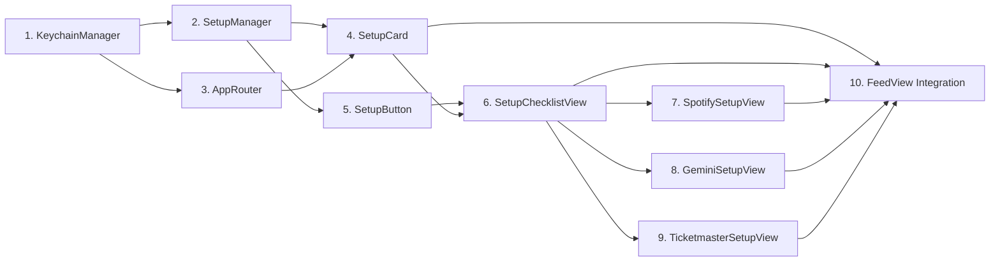

# Setup Feature - Implementation Tasks

## Summary
- **Total tasks**: 10
- **Complexity**: Medium

## Task Dependency Graph

## Tasks

### Task 1: Update KeychainManager for Ticketmaster
- **Status**: Completed
- **Dependencies**: None
- **Files**:
  - Modify: `vibes/Services/KeychainManager.swift`
- **Requirements Addressed**: NFR-1
- **Description**:
  Add Ticketmaster API key storage to KeychainManager. This enables secure storage of the Ticketmaster API key alongside existing Spotify and Gemini credentials.
- **Implementation Notes**:
  - Add `ticketmasterApiKey` case to `Key` enum
  - Add `saveTicketmasterApiKey(_ key: String)` method
  - Add `getTicketmasterApiKey() -> String?` method
  - Follow existing patterns for save/retrieve
- **Acceptance Criteria**:
  - [ ] `ticketmasterApiKey` added to Key enum
  - [ ] Can save Ticketmaster API key to Keychain
  - [ ] Can retrieve Ticketmaster API key from Keychain
  - [ ] Builds without errors

---

### Task 2: Create SetupManager
- **Status**: Completed
- **Dependencies**: Task 1
- **Files**:
  - Create: `vibes/Services/SetupManager.swift`
- **Requirements Addressed**: FR-4, FR-13
- **Description**:
  Create the centralized state manager for tracking setup completion. Uses @Observable pattern and derives completion state from Keychain/UserDefaults presence.
- **Implementation Notes**:
  - Use `@Observable` class (not ObservableObject)
  - Computed properties for `isSpotifyComplete`, `isGeminiComplete`, `isTicketmasterComplete`
  - `completedCount` computed as sum of complete steps
  - `isAllComplete` computed as `completedCount == 3`
  - Check Keychain for tokens/keys, UserDefaults for city
- **Acceptance Criteria**:
  - [ ] SetupManager compiles with @Observable
  - [ ] `isSpotifyComplete` returns true when Spotify token exists
  - [ ] `isGeminiComplete` returns true when Gemini key exists
  - [ ] `isTicketmasterComplete` returns true when TM key AND city exist
  - [ ] `completedCount` returns correct count (0-3)

---

### Task 3: Update AppRouter for Setup Navigation
- **Status**: Completed
- **Dependencies**: Task 1
- **Files**:
  - Modify: `vibes/Services/AppRouter.swift`
- **Requirements Addressed**: FR-2, FR-5
- **Description**:
  Add SetupDestination enum and navigation method for setup flow. This enables push navigation from FeedView to setup views.
- **Implementation Notes**:
  - Add `SetupDestination` enum with cases: `checklist`, `spotify`, `gemini`, `ticketmaster`
  - Enum must conform to `Hashable`
  - Add `navigateToSetupChecklist()` method that appends to feedPath
- **Acceptance Criteria**:
  - [ ] `SetupDestination` enum defined
  - [ ] Enum conforms to Hashable
  - [ ] `navigateToSetupChecklist()` method added
  - [ ] Builds without errors

---

### Task 4: Create SetupCard Component
- **Status**: Completed
- **Dependencies**: Task 2, Task 3
- **Files**:
  - Create: `vibes/Views/Setup/SetupCard.swift`
- **Requirements Addressed**: FR-1, FR-2
- **Description**:
  Create the tappable setup card that displays at the top of the Feed tab. Shows progress (X/3 complete) and navigates to SetupChecklistView when tapped.
- **Implementation Notes**:
  - Use `@Environment(SetupManager.self)` for state
  - Display "Setup" title and "X/3 complete" subtitle
  - Use NavigationLink with SetupDestination.checklist
  - Style with secondary background, rounded corners, chevron
  - Add accessibility label describing current progress
- **Acceptance Criteria**:
  - [ ] Card displays "Setup" title
  - [ ] Card shows correct completion count
  - [ ] Tapping card navigates to checklist
  - [ ] Accessibility label announces progress

---

### Task 5: Create SetupButton Component
- **Status**: Completed
- **Dependencies**: Task 2
- **Files**:
  - Create: `vibes/Views/Setup/SetupButton.swift`
- **Requirements Addressed**: FR-3, FR-4, FR-5
- **Description**:
  Create reusable button component with red/green state indication. Used in SetupChecklistView for each of the three setup steps.
- **Implementation Notes**:
  - Props: `title`, `subtitle`, `isComplete`, `destination`
  - Use NavigationLink(value: destination)
  - Red icon + red tint when incomplete
  - Green icon + green tint when complete
  - Icons: `exclamationmark.circle.fill` (red), `checkmark.circle.fill` (green)
  - Background: `Color.red.opacity(0.1)` or `Color.green.opacity(0.1)`
  - Add accessibility label: "[title], [configured/not configured]"
- **Acceptance Criteria**:
  - [ ] Button displays title and subtitle
  - [ ] Incomplete state shows red styling
  - [ ] Complete state shows green styling
  - [ ] Tapping navigates to destination
  - [ ] Accessibility label describes state

---

### Task 6: Create SetupChecklistView
- **Status**: Completed
- **Dependencies**: Task 4, Task 5
- **Files**:
  - Create: `vibes/Views/Setup/SetupChecklistView.swift`
- **Requirements Addressed**: FR-3, FR-4, FR-5
- **Description**:
  Create the checklist view displaying three SetupButtons. Each button reflects its completion state and navigates to the corresponding setup view.
- **Implementation Notes**:
  - Use `@Environment(SetupManager.self)` for state
  - VStack with three SetupButton instances
  - Pass correct `isComplete` from SetupManager
  - Navigation title: "Setup"
  - Add padding around buttons
- **Acceptance Criteria**:
  - [ ] Three buttons displayed vertically
  - [ ] Each button shows correct completion state
  - [ ] Tapping each button navigates correctly
  - [ ] Navigation title is "Setup"

---

### Task 7: Create SpotifySetupView
- **Status**: Completed
- **Dependencies**: Task 6
- **Files**:
  - Create: `vibes/Views/Setup/SpotifySetupView.swift`
- **Requirements Addressed**: FR-6, FR-7, FR-12
- **Description**:
  Create the Spotify setup view with instructions and OAuth connection button. Shows connected state when complete with disconnect option.
- **Implementation Notes**:
  - Header: "Connect Spotify"
  - Instructions text explaining why Spotify is needed
  - If not connected: "Connect with Spotify" button
  - If connected: Show "Connected" status with "Disconnect" button
  - OAuth triggers existing SpotifyService (placeholder for now)
  - On success: pop back using `@Environment(\.dismiss)`
  - Use `@Environment(SetupManager.self)` to check state
- **Acceptance Criteria**:
  - [ ] Header displays "Connect Spotify"
  - [ ] Instructions are displayed
  - [ ] Connect button shown when not connected
  - [ ] Connected status shown when connected
  - [ ] Disconnect option available when connected

---

### Task 8: Create GeminiSetupView
- **Status**: Completed
- **Dependencies**: Task 6
- **Files**:
  - Create: `vibes/Views/Setup/GeminiSetupView.swift`
- **Requirements Addressed**: FR-8, FR-9, FR-12
- **Description**:
  Create the Gemini setup view with instructions, external link, text field, and save button. Validates key before saving.
- **Implementation Notes**:
  - Header: "Gemini API Key"
  - Instructions explaining how to get free key
  - Link to Google AI Studio: `https://aistudio.google.com/apikey`
  - SecureField for API key entry
  - If editing: show masked current key (e.g., "sk-...xxxx")
  - Save button triggers validation
  - Show loading state during validation
  - Show error alert if invalid
  - On success: save to Keychain, pop back
  - Use `@State` for apiKey, isLoading, errorMessage
- **Acceptance Criteria**:
  - [ ] Header displays "Gemini API Key"
  - [ ] Instructions are displayed
  - [ ] Link opens Google AI Studio in browser
  - [ ] Text field accepts API key input
  - [ ] Save button validates before saving
  - [ ] Error shown for invalid key
  - [ ] Pops back on success

---

### Task 9: Create TicketmasterSetupView
- **Status**: Completed
- **Dependencies**: Task 6
- **Files**:
  - Create: `vibes/Views/Setup/TicketmasterSetupView.swift`
- **Requirements Addressed**: FR-10, FR-11, FR-12
- **Description**:
  Create the Ticketmaster setup view with instructions, external link, API key field, city field, and save button.
- **Implementation Notes**:
  - Header: "Ticketmaster"
  - Instructions explaining how to get API key
  - Link to developer portal: `https://developer.ticketmaster.com/`
  - SecureField for API key
  - TextField for city name
  - If editing: show masked API key and current city
  - Save button validates API key
  - Save key to Keychain, city to UserDefaults
  - Show error alert if invalid
  - On success: pop back
  - Use `@State` for apiKey, city, isLoading, errorMessage
- **Acceptance Criteria**:
  - [ ] Header displays "Ticketmaster"
  - [ ] Instructions are displayed
  - [ ] Link opens developer portal in browser
  - [ ] API key field accepts input
  - [ ] City field accepts input
  - [ ] Save validates and saves both values
  - [ ] Error shown for invalid key
  - [ ] Pops back on success

---

### Task 10: Integrate Setup Flow into FeedView
- **Status**: Completed
- **Dependencies**: Task 4, Task 6, Task 7, Task 8, Task 9
- **Files**:
  - Modify: `vibes/ContentView.swift`
  - Modify: `vibes/vibesApp.swift`
- **Requirements Addressed**: FR-1, FR-2
- **Description**:
  Integrate the setup flow into FeedView and add SetupManager to app environment. Replace existing SetupCard usage with new component.
- **Implementation Notes**:
  - In vibesApp.swift:
    - Add `@State private var setupManager = SetupManager()`
    - Add `.environment(setupManager)` to ContentView
  - In FeedView:
    - Replace existing conditional SetupCard with new `SetupCard()` (always visible)
    - Add `.navigationDestination(for: SetupDestination.self)` handling
    - Route to SetupChecklistView, SpotifySetupView, GeminiSetupView, TicketmasterSetupView
  - Remove old SetupCard struct (the one with button action)
- **Acceptance Criteria**:
  - [ ] SetupManager in environment
  - [ ] SetupCard appears at top of Feed
  - [ ] SetupCard is always visible
  - [ ] Tapping card navigates to checklist
  - [ ] Checklist navigates to individual setup views
  - [ ] App builds and runs successfully

---

## Implementation Order

1. **Task 1** - KeychainManager update (foundation)
2. **Task 2** - SetupManager (state management)
3. **Task 3** - AppRouter update (navigation)
4. **Task 5** - SetupButton component (reusable UI)
5. **Task 4** - SetupCard component (entry point)
6. **Task 6** - SetupChecklistView (main checklist)
7. **Task 7** - SpotifySetupView (first setup step)
8. **Task 8** - GeminiSetupView (second setup step)
9. **Task 9** - TicketmasterSetupView (third setup step)
10. **Task 10** - FeedView integration (wire everything together)

## Integration Checklist

- [x] All 10 tasks completed
- [x] App builds without errors
- [ ] App runs on simulator
- [ ] SetupCard visible at top of Feed
- [ ] SetupCard shows correct progress count
- [ ] Tapping SetupCard navigates to checklist
- [ ] Checklist shows 3 buttons with correct states
- [ ] Each button navigates to its setup view
- [ ] Spotify setup view displays correctly
- [ ] Gemini setup view with key entry works
- [ ] Ticketmaster setup view with key + city works
- [ ] Completing a step updates button to green
- [ ] Green buttons still navigable for editing
