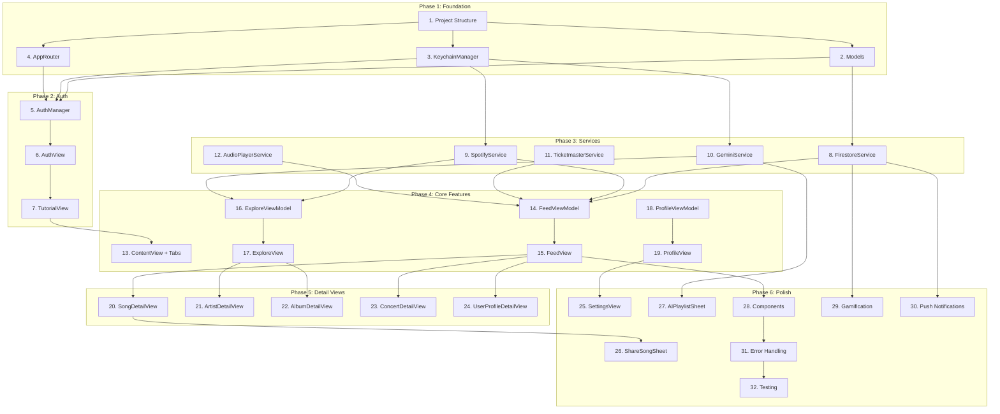

# Vibes - Implementation Tasks

## Summary
- **Total tasks**: 32
- **Complexity**: High
- **Phases**: 6 (Foundation → Auth → Services → Core Features → Detail Views → Polish)

---

## Task Dependency Graph

---

## Phase 1: Foundation

### Task 1: Project Structure Setup
- **Status**: Completed
- **Dependencies**: None
- **Files**:
  - Create: `vibes/Models/` directory
  - Create: `vibes/ViewModels/` directory
  - Create: `vibes/Views/Auth/` directory
  - Create: `vibes/Views/Feed/` directory
  - Create: `vibes/Views/Explore/` directory
  - Create: `vibes/Views/Profile/` directory
  - Create: `vibes/Views/Detail/` directory
  - Create: `vibes/Views/Settings/` directory
  - Create: `vibes/Views/Sheets/` directory
  - Create: `vibes/Views/Components/` directory
  - Create: `vibes/Services/` directory
  - Create: `vibes/Utilities/` directory
  - Create: `vibes/Utilities/Constants.swift`
- **Requirements Addressed**: FR-DEV-4
- **Description**:
  Set up the project directory structure following the design spec. Create placeholder directories and a Constants file for API endpoints and configuration keys.
- **Implementation Notes**:
  - Follow feature-based organization (not type-based)
  - Constants.swift should have enums for Keychain keys, UserDefaults keys, notification names
  - Add Firebase SDK packages if not already added
- **Acceptance Criteria**:
  - [ ] All directories created
  - [ ] Constants.swift compiles
  - [ ] Firebase SDK added to project

---

### Task 2: Data Models
- **Status**: Completed
- **Dependencies**: Task 1
- **Files**:
  - Create: `vibes/Models/UserProfile.swift`
  - Create: `vibes/Models/Friendship.swift`
  - Create: `vibes/Models/SongShare.swift`
  - Create: `vibes/Models/Message.swift`
  - Create: `vibes/Models/MessageThread.swift`
  - Create: `vibes/Models/FeedItem.swift`
  - Create: `vibes/Models/Concert.swift`
  - Create: `vibes/Models/Achievement.swift`
  - Create: `vibes/Models/ListeningStats.swift`
  - Create: `vibes/Models/UnifiedTrack.swift`
- **Requirements Addressed**: All (data foundation)
- **Description**:
  Create all Codable data models as specified in design.md. Models must be Firestore-compatible with @DocumentID support.
- **Implementation Notes**:
  - All models conform to Codable, Identifiable
  - Use @DocumentID for Firestore document IDs
  - FeedItem is an enum wrapping different content types
  - UnifiedTrack wraps Spotify track data
- **Acceptance Criteria**:
  - [ ] All models compile
  - [ ] Models conform to Codable
  - [ ] Models conform to Identifiable
  - [ ] FeedItem enum handles all feed content types

---

### Task 3: KeychainManager
- **Status**: Completed
- **Dependencies**: Task 1
- **Files**:
  - Create: `vibes/Services/KeychainManager.swift`
- **Requirements Addressed**: NFR-3, NFR-4
- **Description**:
  Implement secure token storage using iOS Keychain. Must support save, retrieve, delete operations for Spotify tokens and Gemini API key.
- **Implementation Notes**:
  - Use Security framework (SecItemAdd, SecItemCopyMatching, etc.)
  - Define Key enum for all stored keys
  - Handle keychain errors gracefully
  - Provide clearAll() for sign out
- **Acceptance Criteria**:
  - [ ] Can save string to keychain
  - [ ] Can retrieve string from keychain
  - [ ] Can delete specific key
  - [ ] Can clear all keys
  - [ ] No data stored in UserDefaults

---

### Task 4: AppRouter
- **Status**: Completed
- **Dependencies**: Task 1
- **Files**:
  - Create: `vibes/Services/AppRouter.swift`
- **Requirements Addressed**: FR-4.4 (navigation)
- **Description**:
  Implement centralized navigation coordinator using @Observable. Manages tab selection, NavigationPaths for each tab, and sheet presentation.
- **Implementation Notes**:
  - Use @Observable (not ObservableObject) for iOS 17+
  - Tab enum with feed, explore, profile cases
  - NavigationPath for each tab
  - Sheet enum for modal presentation
  - Navigation helper methods
- **Acceptance Criteria**:
  - [ ] Tab switching works
  - [ ] NavigationPaths managed per tab
  - [ ] Sheet presentation works
  - [ ] Can navigate to detail views programmatically

---

## Phase 2: Authentication

### Task 5: AuthManager
- **Status**: Completed
- **Dependencies**: Task 2, Task 3, Task 4
- **Files**:
  - Create: `vibes/Services/AuthManager.swift`
- **Requirements Addressed**: FR-1.1, FR-1.7, FR-1.8
- **Description**:
  Implement Firebase Auth manager with Google Sign-In. Handles auth state, user profile loading, sign out, and account deletion.
- **Implementation Notes**:
  - Singleton with @MainActor
  - Firebase Auth state listener
  - Google Sign-In integration
  - Load UserProfile from Firestore on auth
  - Clear keychain on sign out
- **Acceptance Criteria**:
  - [ ] Google Sign-In flow works
  - [ ] Auth state persisted across launches
  - [ ] User profile loaded from Firestore
  - [ ] Sign out clears all data
  - [ ] Delete account removes Firestore data

---

### Task 6: AuthView
- **Status**: Completed
- **Dependencies**: Task 5
- **Files**:
  - Create: `vibes/Views/Auth/AuthView.swift`
- **Requirements Addressed**: FR-1.1
- **Description**:
  Create the authentication view with Google Sign-In button. Simple, clean design with app logo and single sign-in option.
- **Implementation Notes**:
  - Use GoogleSignInButton from SDK
  - Show loading state during auth
  - Handle and display errors
  - Navigate to Tutorial on success (new users)
  - Navigate to main app on success (returning users)
- **Acceptance Criteria**:
  - [ ] Google Sign-In button displayed
  - [ ] Loading state shown during auth
  - [ ] Errors displayed to user
  - [ ] Correct navigation after auth

---

### Task 7: TutorialView
- **Status**: Completed
- **Dependencies**: Task 6
- **Files**:
  - Create: `vibes/Views/Auth/TutorialView.swift`
- **Requirements Addressed**: FR-1.2
- **Description**:
  Create 7-card swipeable onboarding tutorial. Each card introduces a feature. Final card prompts Spotify connection.
- **Implementation Notes**:
  - TabView with .tabViewStyle(.page)
  - 7 cards as defined in PRD
  - Progress dots at bottom
  - Skip button on cards 1-6
  - Card 7: Connect Spotify + Skip for now
  - Trigger Spotify OAuth from card 7
- **Acceptance Criteria**:
  - [ ] 7 cards displayed
  - [ ] Swipe navigation works
  - [ ] Progress dots accurate
  - [ ] Skip navigates to main app
  - [ ] Connect Spotify triggers OAuth

---

## Phase 3: Services

### Task 8: FirestoreService
- **Status**: Pending
- **Dependencies**: Task 2
- **Files**:
  - Create: `vibes/Services/FirestoreService.swift`
- **Requirements Addressed**: FR-2.1, FR-2.2, FR-2.4, FR-2.5, FR-8.3
- **Description**:
  Implement Firestore database service for all CRUD operations. Handles users, friendships, song shares, messages, achievements.
- **Implementation Notes**:
  - Singleton with @MainActor
  - Async/await for all operations
  - Real-time listeners return ListenerRegistration
  - Batch writes where appropriate
  - Error handling with VibesError
- **Acceptance Criteria**:
  - [ ] User CRUD operations work
  - [ ] Follow/unfollow operations work
  - [ ] Song share operations work
  - [ ] Real-time feed listener works
  - [ ] Achievement operations work

---

### Task 9: SpotifyService
- **Status**: Pending
- **Dependencies**: Task 3
- **Files**:
  - Create: `vibes/Services/SpotifyService.swift`
- **Requirements Addressed**: FR-1.3, FR-3.1, FR-3.2, FR-10.1
- **Description**:
  Implement Spotify OAuth with PKCE and API wrapper. Handles auth, search, user data, library operations, and playlist management.
- **Implementation Notes**:
  - Use SpotifyAPI package (Peter-Schorn)
  - PKCE flow (no client secret)
  - Store tokens in Keychain
  - Auto-refresh expired tokens
  - Wrap Spotify models in UnifiedTrack
- **Acceptance Criteria**:
  - [ ] OAuth flow with PKCE works
  - [ ] Tokens stored in Keychain
  - [ ] Token refresh works
  - [ ] Search returns results
  - [ ] Can get user's top tracks/artists
  - [ ] Can add to playlist

---

### Task 10: GeminiService
- **Status**: Pending
- **Dependencies**: Task 3
- **Files**:
  - Create: `vibes/Services/GeminiService.swift`
- **Requirements Addressed**: FR-1.4, FR-3.5, FR-6.1, FR-6.2
- **Description**:
  Implement Gemini API integration for AI features. Handles API key validation, playlist generation, and recommendations.
- **Implementation Notes**:
  - User provides their own API key
  - Store key in Keychain
  - Validate key on entry
  - Prompt engineering for playlist generation
  - Return Spotify track IDs from AI responses
- **Acceptance Criteria**:
  - [ ] API key validation works
  - [ ] Key stored in Keychain
  - [ ] Playlist generation returns track IDs
  - [ ] Blend generation works
  - [ ] Graceful error handling

---

### Task 11: TicketmasterService
- **Status**: Pending
- **Dependencies**: Task 1
- **Files**:
  - Create: `vibes/Services/TicketmasterService.swift`
- **Requirements Addressed**: FR-5.1, FR-5.2
- **Description**:
  Implement Ticketmaster Discovery API for concert search. Fetches concerts by city with radius search.
- **Implementation Notes**:
  - API key from configuration
  - Search by city + radius
  - Parse event data into Concert model
  - Handle rate limiting
- **Acceptance Criteria**:
  - [ ] Concert search by city works
  - [ ] Results parsed to Concert model
  - [ ] Ticket URLs included
  - [ ] Rate limit errors handled

---

### Task 12: AudioPlayerService
- **Status**: Pending
- **Dependencies**: Task 1
- **Files**:
  - Create: `vibes/Services/AudioPlayerService.swift`
- **Requirements Addressed**: FR-3.3
- **Description**:
  Implement audio preview playback using AVPlayer. Fetches 30-second previews from iTunes API.
- **Implementation Notes**:
  - Singleton with @MainActor
  - AVPlayer for playback
  - iTunes Search API for preview URLs
  - Only one track plays at a time
  - Published properties for UI binding
- **Acceptance Criteria**:
  - [ ] Can play 30-second preview
  - [ ] Can pause/stop playback
  - [ ] Progress tracking works
  - [ ] Only one track at a time
  - [ ] Handles missing preview gracefully

---

## Phase 4: Core Features

### Task 13: ContentView + Tab Navigation
- **Status**: Pending
- **Dependencies**: Task 7
- **Files**:
  - Modify: `vibes/ContentView.swift`
- **Requirements Addressed**: FR-4.1 (navigation)
- **Description**:
  Implement root ContentView with TabView for 3-tab navigation. Conditionally shows AuthView or main tabs based on auth state.
- **Implementation Notes**:
  - Check authManager.isAuthenticated
  - TabView with Feed, Explore, Profile tabs
  - SF Symbols for tab icons
  - Inject router and authManager to environment
- **Acceptance Criteria**:
  - [ ] Shows AuthView when not authenticated
  - [ ] Shows TabView when authenticated
  - [ ] 3 tabs with correct icons
  - [ ] Tab selection persists

---

### Task 14: FeedViewModel
- **Status**: Pending
- **Dependencies**: Task 8, Task 9, Task 11, Task 12
- **Files**:
  - Create: `vibes/ViewModels/FeedViewModel.swift`
- **Requirements Addressed**: FR-4.1, FR-4.2
- **Description**:
  Implement view model for Feed tab. Loads and merges song shares, concerts, new releases into unified feed with sorting.
- **Implementation Notes**:
  - Parallel fetch: shares + concerts + releases
  - Merge into [FeedItem]
  - Sort by weighted score
  - Real-time listener for shares
  - Pagination support
- **Acceptance Criteria**:
  - [ ] Loads song shares from Firestore
  - [ ] Loads concerts from Ticketmaster
  - [ ] Loads new releases from Spotify
  - [ ] Merges and sorts correctly
  - [ ] Real-time updates work

---

### Task 15: FeedView
- **Status**: Pending
- **Dependencies**: Task 14
- **Files**:
  - Create: `vibes/Views/Feed/FeedView.swift`
  - Create: `vibes/Views/Feed/FeedCardView.swift`
  - Create: `vibes/Views/Feed/SongShareCard.swift`
  - Create: `vibes/Views/Feed/ConcertCard.swift`
  - Create: `vibes/Views/Feed/QuickActionsBar.swift`
- **Requirements Addressed**: FR-4.1, FR-4.3, FR-4.4
- **Description**:
  Implement Feed tab UI with Quick Actions Bar and scrollable feed of mixed content cards.
- **Implementation Notes**:
  - NavigationStack with path binding
  - Sticky QuickActionsBar at top
  - LazyVStack for feed items
  - Different card views for each FeedItem type
  - Pull-to-refresh
  - Empty state view
- **Acceptance Criteria**:
  - [ ] Quick Actions Bar visible
  - [ ] Feed scrolls with mixed content
  - [ ] Cards visually distinct by type
  - [ ] Tap card navigates to detail
  - [ ] Pull-to-refresh works
  - [ ] Empty state shown when needed

---

### Task 16: ExploreViewModel
- **Status**: Pending
- **Dependencies**: Task 9, Task 10
- **Files**:
  - Create: `vibes/ViewModels/ExploreViewModel.swift`
- **Requirements Addressed**: FR-3.1, FR-3.2, FR-3.5
- **Description**:
  Implement view model for Explore tab. Handles Spotify search, For You recommendations, and Grow Your Playlist feature.
- **Implementation Notes**:
  - Debounced search (300ms)
  - Search results by category
  - For You from Spotify recommendations
  - Grow Playlist: select playlist → get AI suggestions
- **Acceptance Criteria**:
  - [ ] Search queries Spotify API
  - [ ] Results categorized correctly
  - [ ] Debouncing works
  - [ ] For You loads recommendations
  - [ ] Grow Playlist suggestions work

---

### Task 17: ExploreView
- **Status**: Pending
- **Dependencies**: Task 16
- **Files**:
  - Create: `vibes/Views/Explore/ExploreView.swift`
  - Create: `vibes/Views/Explore/SearchResultsView.swift`
  - Create: `vibes/Views/Explore/ForYouSection.swift`
  - Create: `vibes/Views/Explore/GrowPlaylistView.swift`
- **Requirements Addressed**: FR-3.1, FR-3.2, FR-3.5
- **Description**:
  Implement Explore tab UI with search bar, For You section, and Grow Your Playlist feature.
- **Implementation Notes**:
  - Search bar at top
  - Show For You when not searching
  - Show search results when searching
  - Grow Playlist with playlist picker dropdown
  - NavigationStack for detail navigation
- **Acceptance Criteria**:
  - [ ] Search bar functional
  - [ ] For You section displays
  - [ ] Search results display correctly
  - [ ] Grow Playlist UI works
  - [ ] Navigation to details works

---

### Task 18: ProfileViewModel
- **Status**: Pending
- **Dependencies**: Task 8
- **Files**:
  - Create: `vibes/ViewModels/ProfileViewModel.swift`
- **Requirements Addressed**: FR-8.1, FR-8.2, FR-8.3, FR-10.1
- **Description**:
  Implement view model for Profile tab. Manages user profile data, following list, and stats.
- **Implementation Notes**:
  - Load user profile from AuthManager
  - Fetch following list
  - Fetch listening stats from Spotify
  - Fetch achievements
  - Handle profile updates
- **Acceptance Criteria**:
  - [ ] Profile data loads
  - [ ] Following list loads
  - [ ] Stats load from Spotify
  - [ ] Achievements load
  - [ ] Profile updates save

---

### Task 19: ProfileView
- **Status**: Pending
- **Dependencies**: Task 18
- **Files**:
  - Create: `vibes/Views/Profile/ProfileView.swift`
  - Create: `vibes/Views/Profile/EditProfileView.swift`
  - Create: `vibes/Views/Profile/FollowingListView.swift`
  - Create: `vibes/Views/Profile/FindUsersView.swift`
  - Create: `vibes/Views/Profile/StatsView.swift`
- **Requirements Addressed**: FR-8.1, FR-8.2, FR-8.3, FR-8.4, FR-10.1
- **Description**:
  Implement Profile tab UI with profile header, setup card, following section, and settings access.
- **Implementation Notes**:
  - Profile header with photo, name, username
  - Edit Profile button → sheet
  - Setup Card if Spotify not connected
  - Following count → following list
  - Settings gear in nav bar
- **Acceptance Criteria**:
  - [ ] Profile header displays correctly
  - [ ] Edit Profile opens sheet
  - [ ] Setup Card shown when needed
  - [ ] Following list navigates
  - [ ] Settings accessible

---

## Phase 5: Detail Views

### Task 20: SongDetailView
- **Status**: Pending
- **Dependencies**: Task 15
- **Files**:
  - Create: `vibes/Views/Detail/SongDetailView.swift`
  - Create: `vibes/ViewModels/SongDetailViewModel.swift`
- **Requirements Addressed**: FR-7.1, FR-2.6
- **Description**:
  Implement full-screen song detail view with artwork, info, preview player, and actions.
- **Implementation Notes**:
  - Large album artwork header
  - Song/artist/album info
  - "From [username]" if shared
  - 30-second preview player
  - Action buttons: Library, Playlist, Share, Spotify
  - Reply with song for received shares
- **Acceptance Criteria**:
  - [ ] Artwork displays large
  - [ ] Song info complete
  - [ ] Sender attribution shown
  - [ ] Preview player works
  - [ ] All action buttons functional

---

### Task 21: ArtistDetailView
- **Status**: Pending
- **Dependencies**: Task 17
- **Files**:
  - Create: `vibes/Views/Detail/ArtistDetailView.swift`
  - Create: `vibes/ViewModels/ArtistDetailViewModel.swift`
- **Requirements Addressed**: FR-7.2
- **Description**:
  Implement artist detail view with image, top songs, albums, and singles.
- **Implementation Notes**:
  - Artist image header
  - Top songs section (from Spotify)
  - Albums section (sorted by date)
  - Singles section
  - Long-press songs for context menu
- **Acceptance Criteria**:
  - [ ] Artist image displays
  - [ ] Top songs load and display
  - [ ] Albums load and display
  - [ ] Context menu on songs works

---

### Task 22: AlbumDetailView
- **Status**: Pending
- **Dependencies**: Task 17
- **Files**:
  - Create: `vibes/Views/Detail/AlbumDetailView.swift`
- **Requirements Addressed**: FR-7.3
- **Description**:
  Implement album detail view with artwork, info, and tracklist.
- **Implementation Notes**:
  - Large album artwork
  - Album name, artist, year
  - Track count, duration
  - Numbered tracklist
  - Tap to preview, long-press for menu
- **Acceptance Criteria**:
  - [ ] Album artwork displays
  - [ ] Album info complete
  - [ ] Tracklist displays
  - [ ] Preview and context menu work

---

### Task 23: ConcertDetailView
- **Status**: Pending
- **Dependencies**: Task 15
- **Files**:
  - Create: `vibes/Views/Detail/ConcertDetailView.swift`
- **Requirements Addressed**: FR-5.2
- **Description**:
  Implement concert detail view with artist, venue, date, and ticket link.
- **Implementation Notes**:
  - Artist image header
  - Date and time
  - Venue with address (tap for Maps)
  - Price range
  - Buy Tickets button (opens Ticketmaster)
- **Acceptance Criteria**:
  - [ ] Concert info displays
  - [ ] Venue opens in Maps
  - [ ] Buy Tickets opens URL

---

### Task 24: UserProfileDetailView
- **Status**: Pending
- **Dependencies**: Task 15
- **Files**:
  - Create: `vibes/Views/Detail/UserProfileDetailView.swift`
- **Requirements Addressed**: FR-7.5, FR-2.1, FR-2.2, FR-6.2
- **Description**:
  Implement other user's profile detail view with follow button and recent shares.
- **Implementation Notes**:
  - Profile photo, name, username, bio
  - Following count
  - Follow/Unfollow button
  - Recent shares section
  - Create Blend button
- **Acceptance Criteria**:
  - [ ] User info displays
  - [ ] Follow/Unfollow works
  - [ ] Recent shares display
  - [ ] Create Blend navigates correctly

---

## Phase 6: Polish

### Task 25: SettingsView
- **Status**: Pending
- **Dependencies**: Task 19
- **Files**:
  - Create: `vibes/Views/Settings/SettingsView.swift`
  - Create: `vibes/Views/Settings/SpotifySettingsView.swift`
  - Create: `vibes/Views/Settings/GeminiKeyView.swift`
  - Create: `vibes/Views/Settings/ConcertCityView.swift`
- **Requirements Addressed**: FR-1.3, FR-1.4, FR-1.5, FR-1.7, FR-1.8
- **Description**:
  Implement Settings screen with all configuration options.
- **Implementation Notes**:
  - Grouped Form style
  - Account section: Sign Out, Delete Account
  - Music Service: Spotify connection status
  - Gemini API: Key status, add/update
  - Concerts: City configuration
  - Support: Replay Tutorial
  - About: Version
- **Acceptance Criteria**:
  - [ ] All sections present
  - [ ] Spotify status accurate
  - [ ] Gemini key management works
  - [ ] Concert city selection works
  - [ ] Sign out works
  - [ ] Delete account works

---

### Task 26: ShareSongSheet
- **Status**: Pending
- **Dependencies**: Task 20
- **Files**:
  - Create: `vibes/Views/Sheets/ShareSongSheet.swift`
  - Create: `vibes/Views/Sheets/UserPickerSheet.swift`
  - Create: `vibes/Views/Sheets/PlaylistPickerSheet.swift`
- **Requirements Addressed**: FR-2.3, FR-2.4, FR-2.5
- **Description**:
  Implement song sharing sheets: Share to All, Send to One, Add to Playlist.
- **Implementation Notes**:
  - ShareSongSheet: message input, Share to All button
  - UserPickerSheet: list of following, sorted by frequency
  - PlaylistPickerSheet: list of user's playlists
  - All dismiss with success toast
- **Acceptance Criteria**:
  - [ ] Share to All works
  - [ ] Send to One with user picker works
  - [ ] Add to Playlist works
  - [ ] Success feedback shown

---

### Task 27: AIPlaylistSheet
- **Status**: Pending
- **Dependencies**: Task 10
- **Files**:
  - Create: `vibes/Views/Sheets/AIPlaylistSheet.swift`
- **Requirements Addressed**: FR-6.1
- **Description**:
  Implement AI playlist generation sheet with prompt input and preview.
- **Implementation Notes**:
  - Text input for prompt
  - Example prompts shown
  - Loading state during generation
  - Preview with track list
  - Regenerate button
  - Save to Spotify button
- **Acceptance Criteria**:
  - [ ] Prompt input works
  - [ ] Generation returns tracks
  - [ ] Preview displays correctly
  - [ ] Save to Spotify creates playlist

---

### Task 28: Reusable Components
- **Status**: Pending
- **Dependencies**: Task 15
- **Files**:
  - Create: `vibes/Views/Components/SongRowView.swift`
  - Create: `vibes/Views/Components/UserRowView.swift`
  - Create: `vibes/Views/Components/LoadingView.swift`
  - Create: `vibes/Views/Components/EmptyStateView.swift`
  - Create: `vibes/Views/Components/ErrorView.swift`
- **Requirements Addressed**: FR-2.3 (context menu), NFR-8 (error handling)
- **Description**:
  Implement reusable UI components following style guide patterns.
- **Implementation Notes**:
  - SongRowView: tap to play, long-press context menu
  - UserRowView: avatar, name, follow button
  - LoadingView: spinner with optional message
  - EmptyStateView: icon, title, message, action button
  - ErrorView: message, retry button
- **Acceptance Criteria**:
  - [ ] SongRowView follows interaction pattern
  - [ ] Context menu has 3 required options
  - [ ] Components adapt to Dynamic Type
  - [ ] Components support dark mode

---

### Task 29: Gamification
- **Status**: Pending
- **Dependencies**: Task 8
- **Files**:
  - Create: `vibes/Services/AchievementService.swift`
  - Modify: `vibes/Views/Profile/ProfileView.swift`
- **Requirements Addressed**: FR-9.1, FR-9.2
- **Description**:
  Implement achievements and vibe streaks tracking.
- **Implementation Notes**:
  - AchievementService checks milestones
  - Unlock on first share, 10 follows, etc.
  - Vibe streak: daily share requirement
  - Cloud Function calculates streaks (or local)
  - Display badges on profile
- **Acceptance Criteria**:
  - [ ] Achievements unlock correctly
  - [ ] Badges display on profile
  - [ ] Streak counter works
  - [ ] Streak icons show correctly

---

### Task 30: Push Notifications
- **Status**: Pending
- **Dependencies**: Task 8
- **Files**:
  - Create: `vibes/Services/NotificationService.swift`
  - Modify: `vibes/vibesApp.swift`
- **Requirements Addressed**: FR-2.5 (notifications)
- **Description**:
  Implement push notifications for song shares and friend activity.
- **Implementation Notes**:
  - Firebase Cloud Messaging setup
  - Request notification permission
  - Store FCM token in user profile
  - Handle notification tap (deep link)
  - Cloud Function sends notifications (or local)
- **Acceptance Criteria**:
  - [ ] Permission requested appropriately
  - [ ] FCM token stored
  - [ ] Notifications received
  - [ ] Tap navigates to content

---

### Task 31: Error Handling & Polish
- **Status**: Pending
- **Dependencies**: Task 28
- **Files**:
  - Create: `vibes/Utilities/VibesError.swift`
  - Modify: All ViewModels
- **Requirements Addressed**: NFR-5, NFR-8
- **Description**:
  Implement comprehensive error handling and offline support.
- **Implementation Notes**:
  - VibesError enum with user-friendly messages
  - ErrorView with retry
  - Offline indicator
  - Cache feed for offline viewing
  - Retry with exponential backoff
- **Acceptance Criteria**:
  - [ ] Errors show user-friendly messages
  - [ ] Retry buttons work
  - [ ] Offline state handled gracefully
  - [ ] No crashes on network failure

---

### Task 32: Testing
- **Status**: Pending
- **Dependencies**: Task 31
- **Files**:
  - Create: `vibesTests/ViewModelTests/FeedViewModelTests.swift`
  - Create: `vibesTests/ViewModelTests/ExploreViewModelTests.swift`
  - Create: `vibesTests/ServiceTests/FirestoreServiceTests.swift`
  - Create: `vibesTests/ModelTests/CodableTests.swift`
  - Create: `vibesUITests/AuthFlowTests.swift`
- **Requirements Addressed**: All (quality assurance)
- **Description**:
  Implement unit tests and UI tests for critical paths.
- **Implementation Notes**:
  - Mock services for unit tests
  - Test ViewModel state changes
  - Test Codable encoding/decoding
  - UI tests for auth flow
  - UI tests for core navigation
- **Acceptance Criteria**:
  - [ ] ViewModel tests pass
  - [ ] Service tests pass (with mocks)
  - [ ] Model tests pass
  - [ ] UI tests pass
  - [ ] 70%+ code coverage on ViewModels

---

## Implementation Order

### Phase 1: Foundation (Tasks 1-4)
1. Task 1 - Project structure setup
2. Task 2 - Data models
3. Task 3 - KeychainManager
4. Task 4 - AppRouter

### Phase 2: Auth (Tasks 5-7)
5. Task 5 - AuthManager
6. Task 6 - AuthView
7. Task 7 - TutorialView

### Phase 3: Services (Tasks 8-12)
8. Task 8 - FirestoreService
9. Task 9 - SpotifyService
10. Task 10 - GeminiService
11. Task 11 - TicketmasterService
12. Task 12 - AudioPlayerService

### Phase 4: Core Features (Tasks 13-19)
13. Task 13 - ContentView + Tabs
14. Task 14 - FeedViewModel
15. Task 15 - FeedView
16. Task 16 - ExploreViewModel
17. Task 17 - ExploreView
18. Task 18 - ProfileViewModel
19. Task 19 - ProfileView

### Phase 5: Detail Views (Tasks 20-24)
20. Task 20 - SongDetailView
21. Task 21 - ArtistDetailView
22. Task 22 - AlbumDetailView
23. Task 23 - ConcertDetailView
24. Task 24 - UserProfileDetailView

### Phase 6: Polish (Tasks 25-32)
25. Task 25 - SettingsView
26. Task 26 - ShareSongSheet
27. Task 27 - AIPlaylistSheet
28. Task 28 - Reusable Components
29. Task 29 - Gamification
30. Task 30 - Push Notifications
31. Task 31 - Error Handling
32. Task 32 - Testing

---

## Integration Checklist

- [ ] All 32 tasks completed
- [ ] App builds without errors
- [ ] App runs on simulator
- [ ] Google Sign-In works
- [ ] Spotify OAuth works
- [ ] Feed loads content
- [ ] Search returns results
- [ ] Song sharing works
- [ ] Profile displays correctly
- [ ] Settings all functional
- [ ] Unit tests passing
- [ ] UI tests passing
- [ ] Dark mode verified
- [ ] Dynamic Type verified
- [ ] VoiceOver verified
