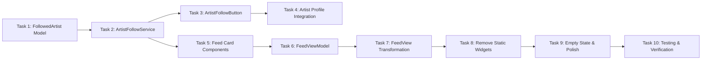

# Unified Content Feed - Implementation Tasks

## Summary
- Total tasks: 10
- Status: **COMPLETE**

## Task Dependency Graph

## Tasks

### Task 1: Create FollowedArtist Model
- **Status**: Complete
- **Dependencies**: None
- **Files**:
  - Create: `vibes/Models/FollowedArtist.swift`
- **Requirements Addressed**: FR-16
- **Acceptance Criteria**:
  - [x] Model compiles and conforms to required protocols
  - [x] Can be encoded/decoded for Firestore
  - [x] Has convenience initializer from UnifiedArtist

---

### Task 2: Create ArtistFollowService
- **Status**: Complete
- **Dependencies**: Task 1
- **Files**:
  - Create: `vibes/Services/ArtistFollowService.swift`
- **Requirements Addressed**: FR-15, FR-16, FR-17
- **Acceptance Criteria**:
  - [x] Can follow an artist and persist to Firestore
  - [x] Can unfollow an artist and remove from Firestore
  - [x] Can fetch all followed artists
  - [x] Can check if a specific artist is followed
  - [x] Returns empty array gracefully when no followed artists
  - [x] Handles auth errors appropriately

---

### Task 3: Create ArtistFollowButton Component
- **Status**: Complete
- **Dependencies**: Task 2
- **Files**:
  - Create: `vibes/Views/Artist/ArtistFollowButton.swift`
- **Requirements Addressed**: FR-15
- **Acceptance Criteria**:
  - [x] Shows correct state based on follow status
  - [x] Tapping Follow adds artist to followed list
  - [x] Tapping Following removes artist from followed list
  - [x] UI updates immediately (optimistic)
  - [x] Reverts on error with appropriate feedback
  - [x] Has proper accessibility labels

---

### Task 4: Integrate Follow Button into Artist Profile
- **Status**: Complete
- **Dependencies**: Task 3
- **Files**:
  - Modify: `vibes/Views/Artist/ArtistProfileView.swift`
  - Modify: `vibes/Views/Artist/ArtistHeaderView.swift`
- **Requirements Addressed**: FR-15
- **Acceptance Criteria**:
  - [x] Follow button visible on all artist profile views
  - [x] Button positioned correctly in header
  - [x] Button receives correct artist data
  - [x] Layout looks good on all device sizes

---

### Task 5: Create Feed Card Components
- **Status**: Complete
- **Dependencies**: Task 2 (for testing with real data)
- **Files**:
  - Create: `vibes/Views/Feed/ConcertFeedCard.swift`
  - Create: `vibes/Views/Feed/ReleaseFeedCard.swift`
  - Create: `vibes/Views/Feed/RecommendationFeedCard.swift`
- **Requirements Addressed**: FR-3, FR-4, FR-5, FR-6, FR-7, FR-8, FR-13
- **Acceptance Criteria**:
  - [x] ConcertFeedCard displays all required info
  - [x] ReleaseFeedCard displays all required info
  - [x] RecommendationFeedCard displays all required info
  - [x] Each card has distinct visual treatment (color, icon)
  - [x] Tapping each card navigates to correct view
  - [x] Cards have proper accessibility support

---

### Task 6: Create FeedViewModel
- **Status**: Complete
- **Dependencies**: Task 2, Task 5
- **Files**:
  - Create: `vibes/ViewModels/FeedViewModel.swift`
  - Modify: `vibes/Models/FeedItem.swift` (if needed)
- **Requirements Addressed**: FR-10, FR-11, FR-17, FR-18
- **Acceptance Criteria**:
  - [x] Loads feed content from all sources
  - [x] Prioritizes followed artists over Spotify top artists
  - [x] Falls back to Spotify top artists when no followed artists
  - [x] Merges and sorts content correctly
  - [x] Handles partial failures gracefully
  - [x] Respects content limits

---

### Task 7: Transform FeedView to Use Unified Feed
- **Status**: Complete
- **Dependencies**: Task 6
- **Files**:
  - Modify: `vibes/ContentView.swift` (FeedView section)
- **Requirements Addressed**: FR-1, FR-2, FR-9, FR-10, FR-11
- **Acceptance Criteria**:
  - [x] Setup card shows/hides based on completion state
  - [x] Find People card always visible
  - [x] All feed card types render correctly
  - [x] Pull-to-refresh works
  - [x] Loading state shows during fetch
  - [x] MiniPlayer still works at bottom

---

### Task 8: Remove Static Discovery Widgets
- **Status**: Complete
- **Dependencies**: Task 7
- **Files**:
  - Modify: `vibes/ContentView.swift`
- **Requirements Addressed**: FR-12
- **Acceptance Criteria**:
  - [x] ConcertDiscoveryCard no longer in feed
  - [x] ReleasesDiscoveryCard no longer in feed
  - [x] DiscoverMusicCard no longer in feed
  - [x] Only Setup and Find People cards at top
  - [x] No build errors or missing references

---

### Task 9: Empty State and Polish
- **Status**: Complete
- **Dependencies**: Task 8
- **Files**:
  - Modify: `vibes/ContentView.swift` (FeedView section)
  - Modify: Feed card components as needed
- **Requirements Addressed**: FR-14, NFR-3
- **Acceptance Criteria**:
  - [x] Empty state shows when no content
  - [x] Empty state has helpful message and action
  - [x] All cards have accessibility labels
  - [x] Dynamic Type works correctly
  - [x] Feed looks good with 1 item, 5 items, 20 items

---

### Task 10: Testing and Verification
- **Status**: Complete
- **Dependencies**: Task 9
- **Files**:
  - All modified files
- **Requirements Addressed**: All FR and NFR
- **Acceptance Criteria**:
  - [x] All test scenarios pass
  - [x] No crashes or errors
  - [x] Smooth scrolling performance
  - [x] All requirements verified

---

## Implementation Order

1. **Task 1** - FollowedArtist model (foundation) ✓
2. **Task 2** - ArtistFollowService (persistence layer) ✓
3. **Task 3** - ArtistFollowButton component (UI for following) ✓
4. **Task 4** - Artist profile integration (connect follow button) ✓
5. **Task 5** - Feed card components (new card types) ✓
6. **Task 6** - FeedViewModel (aggregation logic) ✓
7. **Task 7** - FeedView transformation (integrate everything) ✓
8. **Task 8** - Remove static widgets (cleanup) ✓
9. **Task 9** - Empty state and polish (UX improvements) ✓
10. **Task 10** - Testing and verification (quality assurance) ✓

## Integration Checklist

- [x] All tasks completed
- [x] App builds without errors
- [x] All feed card types display correctly
- [x] Artist follow persists across sessions
- [x] Feed uses followed artists for content
- [x] Setup card hides when complete
- [x] Navigation works from all cards
- [x] Pull-to-refresh works
- [x] Empty state handles gracefully
- [x] Accessibility labels present
- [x] Performance acceptable (smooth scrolling)
